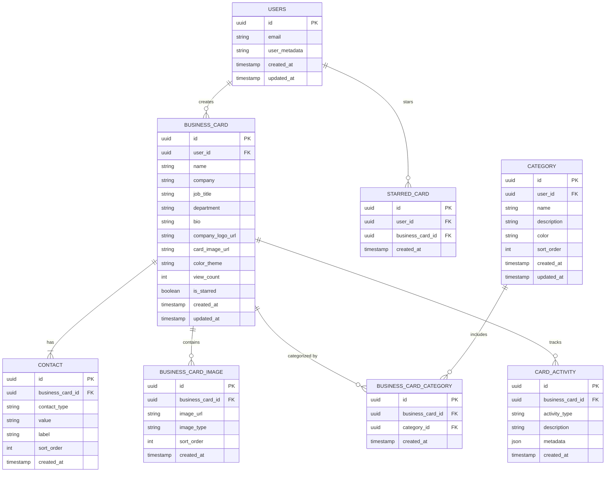
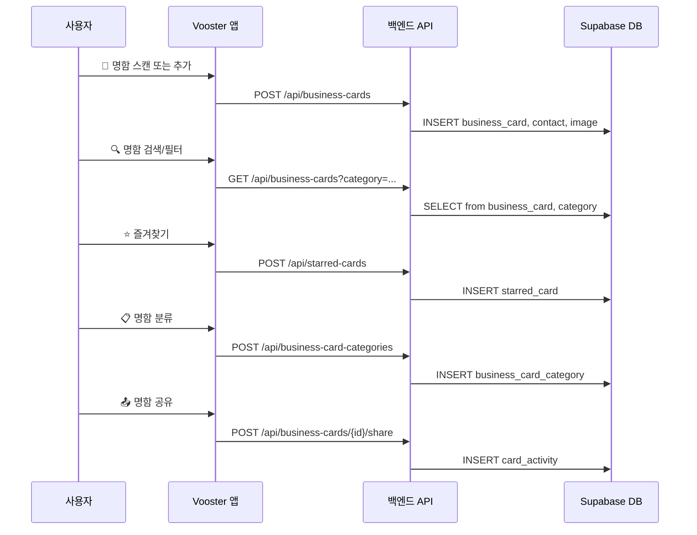
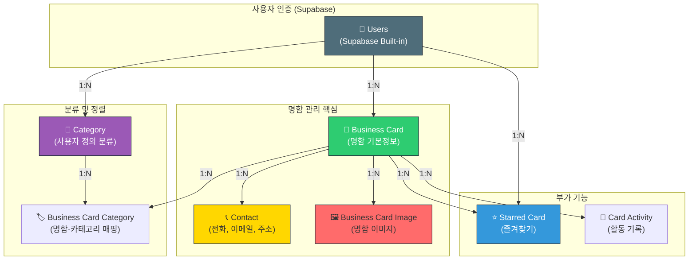

# 명함 관리 시스템 - 데이터베이스 설계

## 📊 ERD (개체-관계 다이어그램)

### Mermaid ERD 형식



---

## 📋 상세 테이블 설명

### 1️⃣ BUSINESS_CARD (명함 메인 테이블)
| 컬럼명 | 타입 | 설명 | 제약사항 |
|--------|------|------|---------|
| `id` | UUID | 명함 고유 ID | PK, AUTO |
| `user_id` | UUID | 소유자 사용자 ID | FK → users(id), NOT NULL |
| `name` | TEXT | 명함 주인 이름 | NOT NULL |
| `company` | TEXT | 회사명 | |
| `job_title` | TEXT | 직책/직급 | |
| `department` | TEXT | 부서 | |
| `bio` | TEXT | 소개 (최대 500자) | |
| `company_logo_url` | TEXT | 회사 로고 URL | |
| `card_image_url` | TEXT | 명함 이미지 URL (썸네일) | |
| `color_theme` | VARCHAR(7) | 명함 테마색 (HEX 코드) | DEFAULT: '#2ECC71' |
| `view_count` | INT | 조회 수 | DEFAULT: 0 |
| `is_starred` | BOOLEAN | 즐겨찾기 여부 (빠른 접근) | DEFAULT: false |
| `created_at` | TIMESTAMPTZ | 생성 날짜 | NOT NULL, DEFAULT: now() |
| `updated_at` | TIMESTAMPTZ | 수정 날짜 | NOT NULL, DEFAULT: now() |

**인덱스**:
- `idx_user_id` - 사용자별 명함 조회 최적화
- `idx_created_at` - 최신순 정렬

---

### 2️⃣ CONTACT (연락처 정보)
| 컬럼명 | 타입 | 설명 | 제약사항 |
|--------|------|------|---------|
| `id` | UUID | 연락처 고유 ID | PK, AUTO |
| `business_card_id` | UUID | 명함 ID | FK → business_card(id), NOT NULL |
| `contact_type` | VARCHAR(50) | 연락처 타입 | NOT NULL (phone, email, address, sns, website) |
| `value` | TEXT | 연락처 값 | NOT NULL |
| `label` | VARCHAR(100) | 라벨 (예: "직장폰", "개인폰") | |
| `sort_order` | INT | 정렬 순서 | DEFAULT: 0 |
| `created_at` | TIMESTAMPTZ | 생성 날짜 | NOT NULL, DEFAULT: now() |

**인덱스**:
- `idx_business_card_id` - 명함별 연락처 조회

---

### 3️⃣ BUSINESS_CARD_IMAGE (명함 이미지)
| 컬럼명 | 타입 | 설명 | 제약사항 |
|--------|------|------|---------|
| `id` | UUID | 이미지 고유 ID | PK, AUTO |
| `business_card_id` | UUID | 명함 ID | FK → business_card(id), NOT NULL |
| `image_url` | TEXT | 이미지 URL | NOT NULL |
| `image_type` | VARCHAR(50) | 이미지 타입 | (original, thumbnail, front, back) |
| `sort_order` | INT | 정렬 순서 | DEFAULT: 0 |
| `created_at` | TIMESTAMPTZ | 생성 날짜 | NOT NULL, DEFAULT: now() |

---

### 4️⃣ CATEGORY (명함 카테고리)
| 컬럼명 | 타입 | 설명 | 제약사항 |
|--------|------|------|---------|
| `id` | UUID | 카테고리 고유 ID | PK, AUTO |
| `user_id` | UUID | 사용자 ID | FK → users(id), NOT NULL |
| `name` | VARCHAR(100) | 카테고리 이름 | NOT NULL (예: "클라이언트", "공급업체") |
| `description` | TEXT | 카테고리 설명 | |
| `color` | VARCHAR(7) | 카테고리 색상 (HEX) | DEFAULT: '#4F6D7A' |
| `sort_order` | INT | 정렬 순서 | DEFAULT: 0 |
| `created_at` | TIMESTAMPTZ | 생성 날짜 | NOT NULL, DEFAULT: now() |
| `updated_at` | TIMESTAMPTZ | 수정 날짜 | NOT NULL, DEFAULT: now() |

**인덱스**:
- `idx_user_id` - 사용자별 카테고리 조회

---

### 5️⃣ BUSINESS_CARD_CATEGORY (명함-카테고리 매핑)
| 컬럼명 | 타입 | 설명 | 제약사항 |
|--------|------|------|---------|
| `id` | UUID | 매핑 고유 ID | PK, AUTO |
| `business_card_id` | UUID | 명함 ID | FK → business_card(id), NOT NULL |
| `category_id` | UUID | 카테고리 ID | FK → category(id), NOT NULL |
| `created_at` | TIMESTAMPTZ | 생성 날짜 | NOT NULL, DEFAULT: now() |

**제약조건**:
- UNIQUE(`business_card_id`, `category_id`) - 중복 방지

**인덱스**:
- `idx_business_card_id` - 명함별 카테고리 조회
- `idx_category_id` - 카테고리별 명함 조회

---

### 6️⃣ STARRED_CARD (즐겨찾기)
| 컬럼명 | 타입 | 설명 | 제약사항 |
|--------|------|------|---------|
| `id` | UUID | 즐겨찾기 고유 ID | PK, AUTO |
| `user_id` | UUID | 사용자 ID | FK → users(id), NOT NULL |
| `business_card_id` | UUID | 명함 ID | FK → business_card(id), NOT NULL |
| `created_at` | TIMESTAMPTZ | 생성 날짜 | NOT NULL, DEFAULT: now() |

**제약조건**:
- UNIQUE(`user_id`, `business_card_id`) - 중복 방지

**인덱스**:
- `idx_user_id` - 사용자 즐겨찾기 조회

---

### 7️⃣ CARD_ACTIVITY (활동 기록)
| 컬럼명 | 타입 | 설명 | 제약사항 |
|--------|------|------|---------|
| `id` | UUID | 활동 고유 ID | PK, AUTO |
| `business_card_id` | UUID | 명함 ID | FK → business_card(id), NOT NULL |
| `activity_type` | VARCHAR(50) | 활동 타입 | (viewed, shared, created, updated, deleted) |
| `description` | TEXT | 활동 설명 | |
| `metadata` | JSONB | 추가 정보 | (예: 공유 대상, 변경 필드) |
| `created_at` | TIMESTAMPTZ | 생성 날짜 | NOT NULL, DEFAULT: now() |

**인덱스**:
- `idx_business_card_id` - 명함별 활동 조회
- `idx_created_at` - 시간순 조회

---

## 🔄 데이터 흐름 (Mermaid 다이어그램)

### 사용자 명함 관리 흐름



---

## 🎯 기능별 쿼리 예시

### 1. 사용자의 모든 명함 조회

```sql
SELECT bc.*, COUNT(bcc.id) as category_count
FROM business_card bc
LEFT JOIN business_card_category bcc ON bc.id = bcc.business_card_id
WHERE bc.user_id = $1
GROUP BY bc.id
ORDER BY bc.created_at DESC;
```

### 2. 특정 카테고리의 명함 조회

```sql
SELECT DISTINCT bc.*
FROM business_card bc
JOIN business_card_category bcc ON bc.id = bcc.business_card_id
WHERE bc.user_id = $1 AND bcc.category_id = $2
ORDER BY bc.created_at DESC;
```

### 3. 명함 상세 정보 (명함 + 연락처 + 이미지 + 카테고리)

```sql
SELECT
    bc.*,
    json_agg(DISTINCT c.*) as contacts,
    json_agg(DISTINCT bci.*) as images,
    json_agg(DISTINCT cat.*) as categories
FROM business_card bc
LEFT JOIN contact c ON bc.id = c.business_card_id
LEFT JOIN business_card_image bci ON bc.id = bci.business_card_id
LEFT JOIN business_card_category bcc ON bc.id = bcc.business_card_id
LEFT JOIN category cat ON bcc.category_id = cat.id
WHERE bc.id = $1 AND bc.user_id = $2
GROUP BY bc.id;
```

### 4. 즐겨찾기 명함 조회

```sql
SELECT bc.*
FROM business_card bc
JOIN starred_card sc ON bc.id = sc.business_card_id
WHERE sc.user_id = $1
ORDER BY sc.created_at DESC;
```

### 5. 명함 검색 (이름, 회사명)

```sql
SELECT DISTINCT bc.*
FROM business_card bc
WHERE bc.user_id = $1
AND (
    bc.name ILIKE $2
    OR bc.company ILIKE $2
    OR bc.department ILIKE $2
)
ORDER BY bc.created_at DESC;
```

---

## 📊 테이블 관계도 (시각화)



---

## 🛠️ 마이그레이션 순서

```
1️⃣ BUSINESS_CARD (메인 테이블)
   ↓
2️⃣ CONTACT (명함 연락처)
   ↓
3️⃣ BUSINESS_CARD_IMAGE (명함 이미지)
   ↓
4️⃣ CATEGORY (사용자 카테고리)
   ↓
5️⃣ BUSINESS_CARD_CATEGORY (매핑)
   ↓
6️⃣ STARRED_CARD (즐겨찾기)
   ↓
7️⃣ CARD_ACTIVITY (활동 기록)
```

---

## 📈 확장성 고려사항

### 추후 추가 가능한 테이블/필드

1. **회사 정보 (Company 테이블)**
   - 사용자가 입력한 회사들의 통합 관리

2. **그룹 관리 (Group 테이블)**
   - 여러 명함을 하나의 그룹으로 관리

3. **명함 교환 이력 (Card Exchange)**
   - 누가 누구와 명함을 교환했는지 기록

4. **메모 (Notes)**
   - 명함별 개인 메모

5. **태그 (Tags)**
   - 카테고리 외 추가 분류

6. **CRM 통합**
   - 외부 CRM 시스템과의 동기화

---

## 🔒 보안 및 권한 관리

### RLS (Row Level Security) 정책

```sql
-- business_card: 자신의 명함만 볼 수 있음
CREATE POLICY "Users can view their own business cards"
  ON business_card FOR SELECT
  USING (auth.uid() = user_id);

-- contact: 명함 소유자만 접근
CREATE POLICY "Users can manage contacts for their cards"
  ON contact FOR ALL
  USING (
    business_card_id IN (
      SELECT id FROM business_card WHERE user_id = auth.uid()
    )
  );

-- category: 사용자 소유 카테고리만 접근
CREATE POLICY "Users can manage their own categories"
  ON category FOR ALL
  USING (auth.uid() = user_id);
```

---

## 📝 요약

| 항목 | 내용 |
|------|------|
| **총 테이블 수** | 7개 |
| **주요 엔티티** | Business Card, Contact, Category |
| **관계 타입** | 1:N (주로) |
| **인덱싱 전략** | user_id, created_at, FK 기반 |
| **인증 방식** | Supabase JWT |
| **동시성 제어** | UNIQUE 제약조건, Timestamp |
| **확장성** | 레코드 기반 추가 가능 |

